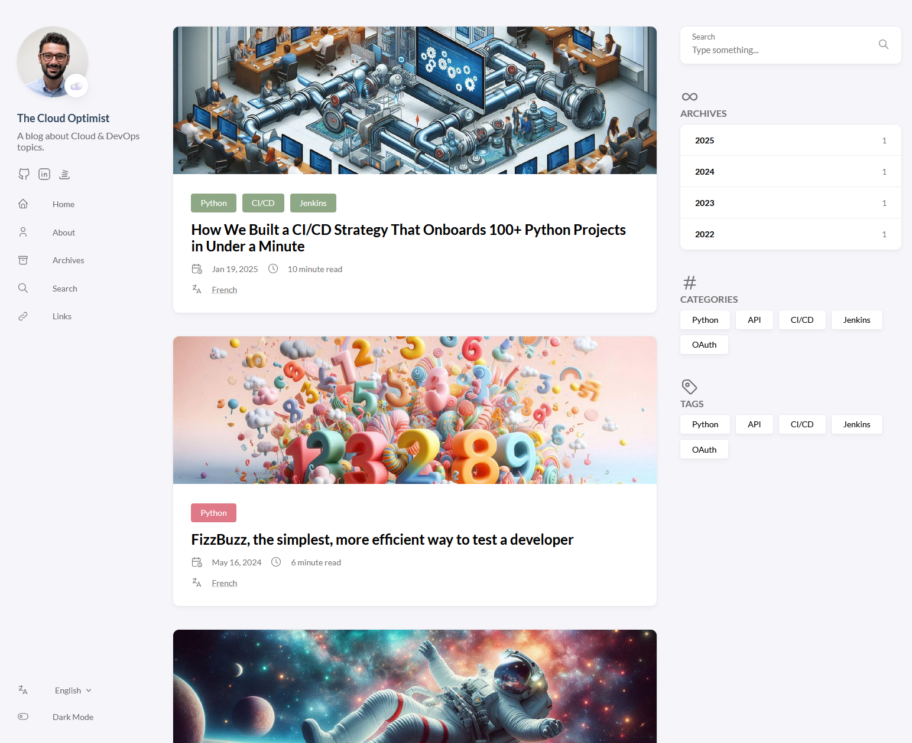
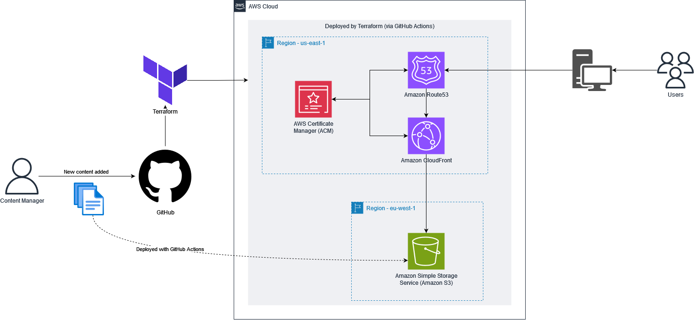

<h1 align=center>The Cloud Optimist | <a href="https://cloud.antoinedelia.fr/" rel="nofollow">Website</a></h1>



This project is a personal blog focused on Cloud & DevOps topics.

It features a static website built with [Hugo](https://gohugo.io/) (with the [Stack theme](https://github.com/CaiJimmy/hugo-theme-stack)) and hosted on [AWS](https://aws.amazon.com/). The infrastructure is managed using [Terraform](https://www.terraform.io/), and all deployments are automated using [GitHub Actions](https://github.com/features/actions).

## Architecture

The blog is hosted on AWS using the following services:
- **S3**: For hosting the static website files.
- **CloudFront**: To deliver content quickly and securely across the globe.
- **Route 53**: For managing the domain name.
- **ACM**: To manage SSL/TLS certificates.

On new commits, a GitHub Action job will deploy the new infrastructure via Terraform (if any changes were detected), build the Hugo website and deploy its content to AWS S3 (again, if new changes are detected).



## Upgrade

### Hugo

To upgrade Hugo, edit the `main.yml` file with [hugo's latest release](https://github.com/gohugoio/hugo/releases):
```yml
# Replace this URL with a newer version
- run: sudo wget https://github.com/gohugoio/hugo/releases/download/v0.133.1/hugo_extended_0.133.1_linux-amd64.deb -O hugo.deb
```
